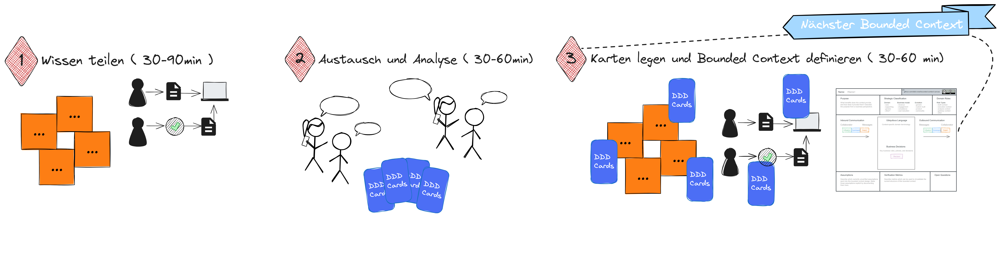

# Das Bounded Context Game

## Ziel des Spiels

Das Ziel des Bounded Context Game ist es, Bounded Context-Kandidaten anhand bekannter Heuristiken zu identifizieren und zu beschreiben.

Heuristiken für den Bounded Context Schnitte:

* Business Capabilities
* Sprach- und Modellunterschiede, 
* Einseitiger Informationsfluss,
* Kohäsive Gruppierung von Aktivitäten (Prozesse, Workflows und Use Cases), 
* Unterschiedliche Auslöser,
* Teams und Lokation

### Die Mission

Einen Bounded Context zu identifizieren und in einem Mindestumfang zu beschreiben, stellt eine Mission für das Team dar. 
Die Mission ist erfüllt, wenn Einigkeit hinsichtlich der vollständigen Verortung aller gewünschten 
Fähigkeiten der Business-Domäne auf Bounded Contexts erfolgt ist und alle Bounded Contexts im Mindestumfang beschrieben sind. 

Zum Mindestumfang gehört:
* Zweck, Verantwortlichkeiten, Existenzbegründung
* angewendete Heuristiken für den Schnitt 
* Wichtigste Geschäftsereignisse und Domänenobjekte (sowie die Bounded Context spezifische Bedeutung der Ereignisse und Domänenobjekte).

Eine empfehlenswerte Vorlage für die Beschreibung eines Bounded Contexts mit dem beschriebenen Mindestumfang 
ist das Bounded Context Canvas der DDD-Crew, das über die unterschiedlichen Spiele der DDD-Cards iterativ
vervollständigt werden kann.

## Spielvorbereitung

Um das Bounded Context Game zu spielen, wird visualisiertes Wissen über die Business-Domäne benötigt.

Diese Wissensgrundlage ensteht als Ergebnisse der Domain Discovery mittels Collaborative Modeling. Aus unserer Erfahrung
passende Visualisierung von Domänenwissen find sich in 
* einer Business Capability Map, 
* in einem Event Storm,
* in Domain Stories,
* Examples und Rules auf Basis von Example Mapping.
* Customer Journey Modellen sowie
* fachlichen Prozessmodellen.

Metaphorisch oder auch physisch stellen diese Modelle das Spielfeld des Bounded Context Game.

Benennung einer fachkundigen Moderator/in und eines Scopes, falls die Business-Domäne zu groß ist.

## Spielverlauf

> (Optional) 0 Präsentation der Business-Domäne (30 bis 60 Minuten)

Präsentation der Business-Domäne und den gewünschten Fähigkeiten und Anwendungsfälle anhand der Visualisierung der Domain Discovery
und ergänzenden Materialien.

Dies ist notwendig, wenn nicht alle Spieler/innen mit den Herausforderungen, Szenarien und Anwendungsfällen vertraut sind.

> 1 Wissen teilen (30 bis 90 Minuten)

Die Moderator/in stellt die Artefakte der Domain Discovery vor und erläutert die Zusammenhänge und Herausforderungen der Business-Domäne.
Die Spieler/innen haben die Möglichkeit, Fragen zu stellen und sich mit den Artefakten auseinanderzusetzen.

> 2 Austausch und Analyse (30 bis 60 Minuten)

In der nächsten Spielphase setzt sich jede Spieler/in für sich oder im Austausch mit anderen Spieler/innen in 
Kleingruppen mit den fachlichen Artefakten auseinander und analysiert den Sachverhalt hinsichtlich der anzuwendenden 
Heuristiken. 

> 3 Karten legen und Bounded Context definieren (30 bis 60 Minuten)
 
Mindestens eine Spieler/in beginnt nun ihren ersten Bounded Context Schnitt auf dem Spielfeld zu visualisieren und die Karten 
zum Schnitt zu legen, die als Heuristik für den Schnitt angewendet werden.

Heuristiken zu begründen. Dadurch erhält die Diskussion einen Scope, und andere Spieler/innen werden eingeladen, 
ihre Karten ebenfalls zu legen und ihre Perspektive zu erläutern. An dieser Stelle ist die Moderator/in gefordert, 
die Gruppendiskussion zu lenken, sodass nach 30 bis 60 Minuten eine erste Beschreibung für einen Bounded Context entsteht. 

In der Regel bringt diese Diskussion bereits Anhaltspunkte für weitere Bounded Context Kandidaten zum Vorschein, 
und der nächste Schritt kristallisiert sich durch die Spieldynamik heraus. Ist dies nicht der Fall, beginnt wieder eine 
Spieler/in mit der visualisierung eines Schnitts und legen der Karten.

Das Spiel ist beendet, wenn alle Bereiche des Spielfeldes in einem Bounded Context enthalten sind und jeder Bounded Context
im Team entschieden und beschrieben ist.

> Visueller Spielablauf

