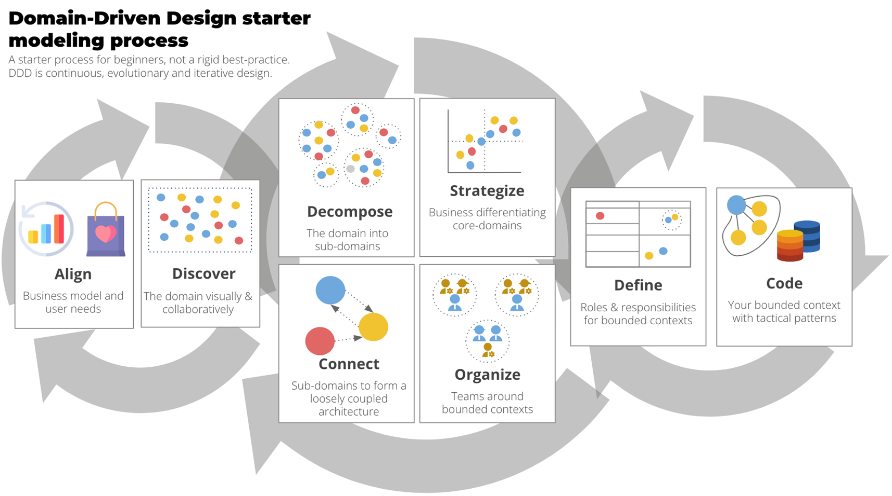
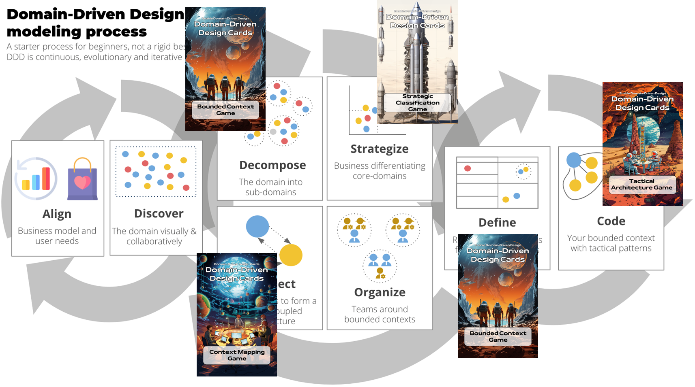

# Domain-Driven Design erfolgreich anwenden

## Domain-Driven Design Starter Modeling Process der DDD-Crew

Die [DDD-Crew]() beschreibt ihren [Domain-Driven Design Starter Modeling Process]() als einen

> Schritt-für-Schritt-Leitfaden zum Lernen und praktischen Anwenden jedes Aspekts von Domain-Driven Design (DDD) – von der Orientierung am Geschäftsmodell einer Organisation bis hin zur Codierung eines Domain-Modells.

Der Prozess umfasst alle Aspekte zur Gestaltung der Softwarearchitektur einer komplexen Geschäftsdomain mit der DDD-Denkweise!

Der Prozess ist keine lineare Abfolge von Schritten, die befolgt werden sollten. Domain-Driven Design ist ein evolutionärer Designprozess, der kontinuierliche Iterationen auf allen Wissens- und Designaspekten erfordert.

Der Prozess unterstützt mit wertvollem Wissen und Methoden zur Durchführung der einzelnen Prozessschritte. Für jeden Schritt beschreibt der Prozess, wer einbezogen werden soll und welche (kollaborativen) Methoden und Werkzeuge nützlich sind.

Insbesondere wenn Domain-Driven Design eingeführt wird, ist es notwendig, Wissen zu lernen und aufzubauen. Die Geschäftsdomain benötigt ein Architektur-(Modernisierungs-)Enabling, um Domain-Driven Design erfolgreich zu etablieren. Es spielt keine Rolle, ob es sich um ein Greenfield- oder ein Brownfield-Projekt handelt. Nur dass das Brownfield schwieriger ist und zusätzliche Aspekte berücksichtigt werden müssen.

Domain-Driven Design Cards ist ein Gamification-Ansatz, der in verschiedenen Schritten des Domain-Driven Design Starter Modeling Process angewendet werden kann, um Zusammenarbeit zu unterstützen, die Schritte durchzuführen und on-the-job zu lernen.

[Lesen Sie hier mehr](./mkdocs-en.md) über die Idee des Enablings durch Gamification.

## Domain-Driven Design Cards im Starter Modeling Process

Die folgende Visualisierung zeigt den Starterprozess und die Schritte, die mit dem Spiel der Domain-Driven Design Cards unterstützt werden.

### Zerlegen und Definieren

### Verbinden

### Code

### Ganzheitliche Anwendung der Domain-Driven Design Cards