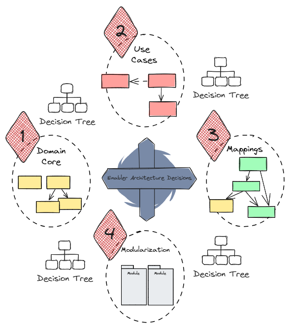

# Das Tactical Architecture Game

## Ziel des Spiels

Das Tactical Architecture Game hat das Ziel grundlegende Architekturentscheidungen zu diskutieren und eine Teamentscheidung
im Konsent für jede relevante Fragestellung zu finden. Hierfür stellt das Spiel ein Set an Entscheidungen 
(Enabler Architecture Decisions), eingeteilt in Entscheidungskategorien, bereit.

Das Tactical Architecture Game kann mit dem Wirkungsbereich bezogen auf einen Bounded Context, ein Entwicklungsteam
oder auch eine Gruppe von Entwicklungsteams, die über einen Systemverbund eine gleichartige taktische Architektur
erreichen möchten, angewendet werden. Das Spiel adressiert taktischen Domain-Driven Design und domänen-zentrische Architekturmuster, 
wie z.B. die Clean Architecture, Hexagonal Architecture oder Onion Architecture.

### Die Mission

Jede Entscheidungskategorie stellt eine zu erfüllende Mission des Teams dar, die durch das Finden einer 
oder mehrerer Architekturentscheidungen abgeschlossen wird. Sind alle Missionen erfüllt, ist das Spiel zu Ende.

## Spielvorbereitung

Zur Spielvorbereitung gehört die Vorbereitung des Spielfelds in physischer oder digitaler Form. 
Der Wirkungsbereich ist im Vorfeld zu klären und auf dem Spielfeld zu dokumentieren.

Das Spielfeld enthält Entscheidungskategorien und die Fragestellungen für eine zu treffende Entscheidung. 
Die Spielkarten beschreiben zum einen die Fragestellung sowie passende Muster und Lösungsstrategien.

## Spielverlauf

Das Spiel führt die Spieler und Spielerinnen entlang der Entscheidungskategorien, von inneren _Ring / Hexagon / Onion_
zum äußeren. Für jede Entscheidung startet ein Entscheidungsfindungsprozess zwischen den Spieler:innen.
Wechselwirkungen zwischen Entscheidungen sind auf dem Spielfeld angegeben und müssen bei der Entscheidungsfindung ebenfalls
berücksichtigt werden.

Die Entscheidungskategorien werden in der folgenden Reihenfolge durchlaufen:

1. Domänenkern
2. Anwendungsfälle
3. Mappings
4. Modularization

Bestandteile des Entscheidungsfindungsprozess einer taktischen Architekturentscheidung sind:

* Austausch über Fragestellung und Lösungsstrategie für das gemeinsame Verständnis
* Austausch über Fragestellung und Lösungsstrategie im spezifischen Projektkontext anhand bekannter Anwendungsfälle und Qualitätsanforderungen
* Formulierung von Entscheidungsalternativen
* Finden einer Konsententscheidung im Team

Jede Entscheidung muss innerhalb einer Timebox von 30 Minuten gefunden werden. Ist dies nicht möglich, 
muss die Mission zu einem späteren Zeitpunkt wiederholt werden. 
Von dieser Timebox sind mindestens 10 Minuten für die Formulierung von Entscheidungsalternativen und für das Treffen 
der Entscheidung zu verwenden. Bei großen Teams kann die Timebox erhöht werden, sollte jedoch als Richtwert 45 Minuten
nicht überschreiten.

> Spielfeld

