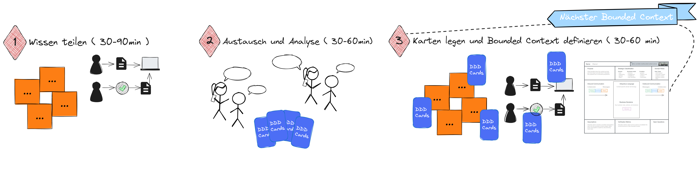

# Das Bounded Context Game

## Ziel des Spiels

Das Ziel des Bounded Context Game ist es, Bounded Context-Kandidaten anhand bekannter 
Heuristiken zu identifizieren und zu beschreiben.

Heuristiken für Bounded Context Schnitte sind:

* Business Capabilities
* Sprach- und Modellunterschiede, 
* Einseitiger Informationsfluss,
* Kohäsive Gruppierung von Aktivitäten (Prozesse, Workflows und Use Cases), 
* Unterschiedliche Auslöser,
* Eigenständige Erzeugung von Ergebnissen,
* Teams und Lokation

### Die Mission

Einen Bounded Context zu identifizieren und in einem Mindestumfang zu beschreiben, 
stellt eine Mission für das Team dar. Die Mission ist erfüllt, wenn der Bounded Context 
im Mindestumfang anhand des [Bounded Context Canvas](https://github.com/ddd-crew/bounded-context-canvas) 
der [DDD-Crew](https://github.com/ddd-crew) beschrieben ist. 

Zum Mindestumfang gehört:
* Zweck, Verantwortlichkeiten, Existenzbegründung
* Angewendete Heuristiken für den Schnitt 
* Wichtigste Geschäftsereignisse und Domänenobjekte

Das Spiel besteht aus mehreren Missionen und ist zu Ende, wenn alle Bounded Contexts
einer Business-Domäne oder Subdomäne definiert sind.

## Spielvorbereitung

Um das Bounded Context Game zu spielen, wird visualisiertes Wissen über die 
Business-Domäne benötigt.

Diese Spielgrundlage entsteht als Ergebnisse der Domain Discovery mittels Collaborative Modeling. 
Aus unserer Erfahrung passende Visualisierung von Domänenwissen finden sich in 
* einer Business Capability Map, 
* in einem Event Storm,
* in Domain Stories,
* Examples und Rules auf Basis von Example Mapping,
* Customer Journeys,
* fachlichen Prozessmodellen sowie
* einer Kombination aus den genannten Artefakten.

Metaphorisch oder auch physisch stellen diese Modelle das Spielfeld des Bounded Context Game dar.

## Spielverlauf

> 1 Wissen teilen (30 bis 90 Minuten)

Die Moderator/in stellt die Artefakte der Domain Discovery vor und erläutert die 
Zusammenhänge und Herausforderungen der Business-Domäne. Die Spieler/innen haben die 
Möglichkeit, Fragen zu den fachlichen Anforderungen zu stellen.

> 2 Austausch und Analyse (30 bis 60 Minuten)

In der nächsten Spielphase setzt sich jede Spieler/in für sich oder im Austausch 
mit anderen Spieler/innen mit den fachlichen Artefakten auseinander und analysiert 
den Sachverhalt hinsichtlich der anzuwendenden Heuristiken. 

> 3 Karten legen und Bounded Context definieren (30 bis 60 Minuten)
 
Mindestens eine Spieler/in beginnt nun ihren ersten Bounded Context Schnitt auf dem Spielfeld 
zu visualisieren (z.B. durch Einkreisung) und die Karten zu legen, die als Heuristik für den Schnitt 
angewendet werden.

Dadurch erhält die Diskussion einen Scope, und andere Spieler/innen werden eingeladen, 
ihre Karten ebenfalls zu legen und ihre Perspektive zu erläutern. 
An dieser Stelle ist die Moderator/in gefordert, die Gruppendiskussion zu lenken, 
sodass nach 30 bis 60 Minuten eine erste Beschreibung für einen Bounded Context entsteht.

In der Regel bringt diese Diskussion bereits Anhaltspunkte für weitere Bounded Context Kandidaten 
zum Vorschein, und der nächste Schritt kristallisiert sich durch diese Spieldynamik heraus. 
Ist dies nicht der Fall, beginnt wieder eine Spieler/in mit der visualisierung eines Schnitts und 
legen der Karten.

Das Spiel ist beendet, wenn alle auf dem Spielfeld dargestellten Fähigkeiten und Funktionen 
in einem Bounded Context verortet sind und jeder Bounded Context beschrieben ist.

> Visueller Spielablauf

