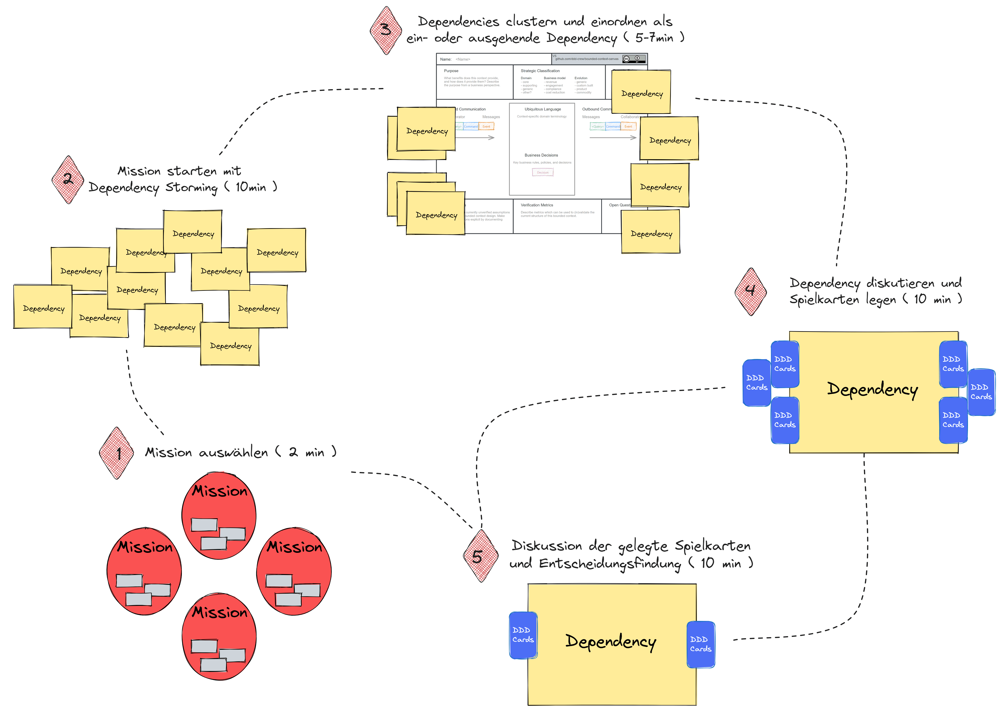

# Das Context Mapping Game

## Kartendeck

## Ziel des Spiels

Das Context Mapping Game hat das Ziel, Abhängigkeiten zwischen Bounded Contexts unter 
Berücksichtigung des
* Call Flow,
* Model Flow sowie
* Influence Flow

zu gestalten.

### Die Mission

Die Definition der Abhängigkeiten zwischen zwei Bounded Contexts anhand der Context Mapping Patterns 
von Domain-Driven Design stellt eine Mission des Teams dar. Das Spiel endet, sobald alle Missionen 
abgeschlossen sind. Dies bedeutet, dass alle Abhängigkeiten zwischen Bounded Contexts definiert wurden.

## Spielvorbereitung

Die Vorbedingung für das Spielen des Context Mapping Game ist die Bekanntheit der Bounded Contexts. 
Jeder Bounded Context ist mittels Bounded Context Canvas beschrieben. 
Die befüllten Bounded Context Canvas werden physisch oder digital als Spielfeld verwendet. 
Sind Subdomänen bekannt, empfiehlt sich, Bounded Contexts der gleichen Subdomäne gruppiert 
auf dem Spielfeld darzustellen.

## Spielverlauf

> 1. Dependency Storming (10 bis 20 Minuten)

Im ersten Schritt des Context Mapping Game entscheidet sich das Team für die erste Mission, 
d.h. für einen zu betrachtenden Bounded Context. Die Mission beginnt mit 10 Minuten Brainstorming 
von Abhängigkeiten für den Bounded Context (Dependency Storming). Eine Abhängigkeit wird als
* Command,
* Query,
* Event,
* (Sub-)System oder
* Akteur

zum Ausdruck gebracht.

Die Abhängigkeiten wird als ein- bzw. ausgehenden Abhängigkeiten kategorisiert 
und als Sticky Notes auf dem Spielfeld platziert.

> 2. Gruppierung der Abhängigkeiten (10 Minuten)

Die Gruppe steigt nun in eine erste Diskussion über die identifizierten Abhängigkeiten ein 
und gruppiert gleiche Nennungen sowie inhaltliche zusammengehörige Elemente 
(z.B. passendens Command oder Query zu einem System oder Akteur).

Identifizierte Abhängigkeiten zwischen Bounded Contexts können optional durch eine 
Verbindungslinie auf dem Spielfeld visualisiert werden.

> 3. Diskussion und Karten legen (15 Minuten)

Im nächsten Schritt wird jede Abhängigkeit im Team mit einer Timebox von 15 Minuten 
diskutiert. Hierbei hat jede Spieler/in die Möglichkeit, ihre Ansicht zu teilen, 
andere Ansichten aufzunehmen und in den Austausch über die dargestellten Sachverhalte 
zu gehen.

Anschließend legt jede Spieler/in seine Karte und teil somit seine Ansicht über die 
Beziehungsdefinition zwischen zwei Bounded Contexts. Eine Abhängigkeit definiert 
zu durch das Legen der **Rollenkarte** (Up- und Downstream) und der **Musterkarte** 
(Context Mapping Pattern je Rolle).

> 4. Entscheidungsfindung (15 Minuten)

Wenn sich eine gemeinsame Basis mit Ausreißern aufzeigt, kann die Entscheidungsfindung 
durch die Erklärung der Ausreißer gestartet werden. Wenn das Ergebnis sehr unterschiedlich
oder einheitlich ist, beginnt eine beliebige Spieler/in mit der Schilderung ihrer Sicht.

Durch den Austausch im Team klären sich nicht mehr passende Muster und Rollen und 
in der Folge werden die Spielkarten vom Spielfeld entfernt. Die Abhängigkeit gilt als 
definiert, wenn die gelegten Karten eine valide und widerspruchsfreie Abbildung 
* der Context Mapping Patterns mittels Musterkarten _und_
* Rollendefinition mittels Rollenkarten abbilden _und_
* alle Spieler/innen über diese Definition der Beziehungsdefinition übereinstimmen.

> Visueller Spielablauf

