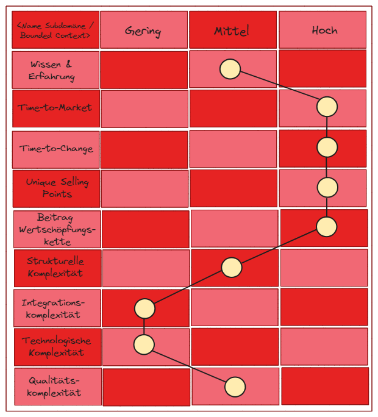
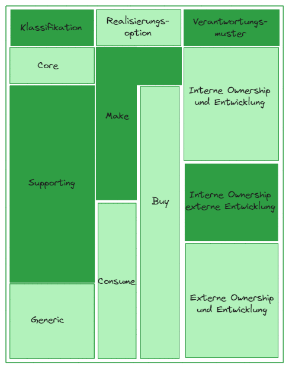
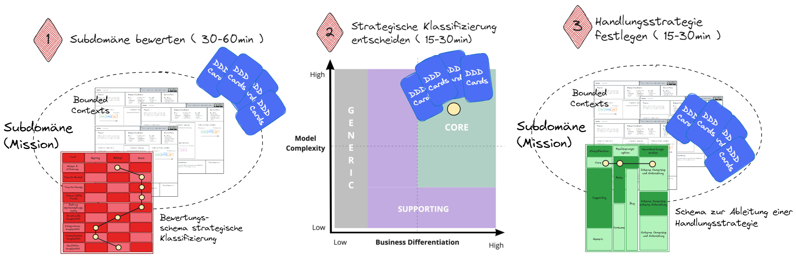

# Das Strategic Classification Game

## Ziel des Spiels

Das Strategic Classification Game zielt darauf ab, die strategische Klassifikation 
einer Subdomäne oder Bounded Context zu ermitteln und die zur Klassifikation passende 
Handlungsstrategie abzuleiten.

### Die Mission

Ermittlung der strategischen Klassifikation und Handlungsstrategie anhand 
des Bewertungs- und des Handlungsstrategieschema. Das Spiel endet, sobald dies für alle 
Subdomänen bzw. Bounded Contexts einer Business-Domäne erfolgt ist.

## Spielvorbereitung

Die Vorbedingung für das Spielen des Strategic Classification Game ist die Bekanntheit 
der Subdomänen und Bounded Contexts. Jeder Bounded Context ist mittels 
Bounded Context Canvas beschrieben. Die Bounded Contexts werden gruppiert 
anhand der Subdomäne dargestellt. Dies wird als Spielfeld 
(physisch oder digital) verwendet.

## Spielverlauf

> 1. Subdomäne (Bounded Contexts) bewerten (60 Minuten)

Das Spiel beginnt mit der Auswahl dem ersten Bewertungsobjekt (Subdomäne oder Bounded Context). 
Dies entspricht der Auswahl der ersten Mission. Für dieses Bewertungsobjekt wird das 
dargestellte Bewertungsschema ausgefüllt.

In den ersten 15 Minuten erhalten die Spieler/innen die Möglichkeit sich Gedanken zu machen 
oder auch bilateral sich mit anderen Spieler/innen auszutauschen. Die Karten des 
Strategic Classification Game geben Hilfestellung und erklären die Bewertungskriterien 
und ihre Einstufung.

Nach dieser Einführungsphase startet die Gruppendiskussion, in der eine beliebige 
Spieler/in ihre Bewertung für das erste Bewertungskriterium mitteilt. Die Mitspieler/innen 
steigen in die Diskussion ein und legen ebenfalls ihre Karten auf das Spielfeld. 
Die Diskussion im Team führt zu einer Entscheidung hinsichtlich der Einstufung 
in gering, mittel oder hoch.

Der Vorgang wird für jedes Bewertungskriterium wiederholt.

> 2. Strategische Klassifizierung entscheiden (15 bis 30 Minuten)

Aufbauend auf der Bewertung der einzelnen Kriterien wird im nächsten Schritt die 
strategische Klassifikation anhand des Bewertungsschemas abgeleitet und 
im [Core Domain Chart](https://github.com/ddd-crew/core-domain-charts) festgehalten.

> 3. Handlungsstrategie festlegen (15 bis 30 Minuten)

Im nächsten Schritt analysieren die Spieler/innen die zur strategischen Klassifizierung 
passende Handlungsstrategie. Diese besteht aus Realisierungsoptionen und 
Verantwortungsmuster. Auch hier sollen die Spieler/innen die Möglichkeit erhalten, 
dies eigenständig zu analysieren oder freiwillig den Austausch mit anderen 
Spieler/innen zu suchen.

Nach dieser Einführungsphase von 10 bis 15 Minuten legt erneut eine beliebige 
Spieler/in ihre Karte für die Realisierungsoption und für das Verantwortungsmuster 
auf das Spielfeld und begründet ihre Perspektive. Die anderen Spieler/innen folgen, 
und der Austausch in der Gruppe entsteht erneut. Abschließend muss in der Gruppe eine 
klare Entscheidung herbeigeführt werden. Diese wird festgehalten, durch Markierung im 
Handlungsstrategieschema.

> Visueller Spielablauf

