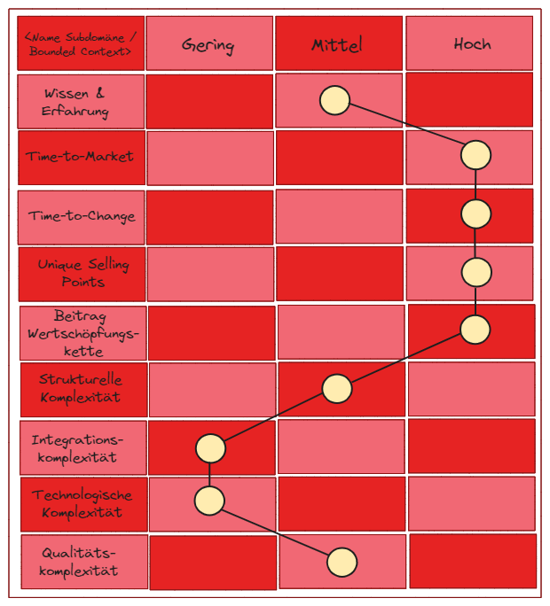
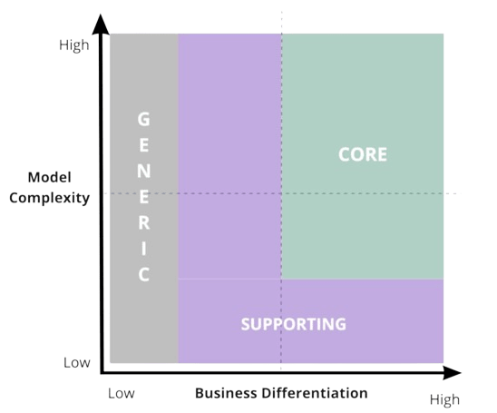

# The Strategic Classification Game

## Objective of the Game

The Strategic Classification Game aims to determine the strategic classification of a 
subdomain or bounded context and to derive the appropriate operational tactic based 
on this classification.

### The Mission

Determine the strategic classification and action strategy using 
the evaluation and operational tactic schema. The game ends once 
this has been done for all subdomains or bounded contexts of a business domain.

## Game Preparation

The prerequisite for playing the Strategic Classification Game is the familiarity 
with the Bounded Contexts. Each Bounded Context is described using the 
Bounded Context Canvas. The Bounded Context Canvases will be grouped by 
subdomain. The visualization are used as playground, 
either physically or digitally. 

## Game Progress

> 1. Evaluate Subdomain (Bounded Contexts) (60 minutes)

The game begins with the selection of the first evaluation object 
(subdomain or bounded context). This corresponds to the selection 
of the first mission. For this evaluation object, the presented evaluation 
schema is filled out.

In the first 15 minutes, players have the opportunity to think independently 
or to exchange ideas bilaterally with other players. The cards of the 
Strategic Classification Game provide assistance and explain the evaluation 
criteria and their classification.

After this introductory phase, the group discussion begins, during which 
any player can share their evaluation for the first evaluation criterion. 
Other players join the discussion. The team discussion leads to a 
decision regarding the classification as low, medium, or high.

This process is repeated for each evaluation criterion.

> 2. Decide on Strategic Classification (15 to 30 minutes)

Based on the evaluation of the individual criteria, the next step is to 
derive the strategic classification using the evaluation schema and to 
document it in the [Core Domain Chart](https://github.com/ddd-crew/core-domain-charts).

> 3. Determine Action Strategy (15 to 30 minutes)

In the next step, the players analyze the action strategy that corresponds 
to the strategic classification. This consists of implementation options 
and responsibility patterns. Here, too, players should have the opportunity 
to analyze this independently or to seek exchange with other players.

After this introductory phase of 10 to 15 minutes, the first player places 
his cards for the implementation option and the responsibility pattern. 
Other players follow, and the group discussion ensues. 
Finally, a clear decision must be made within the group. 
This is documented by marking it in the action strategy schema.

> Visual Game Progress

