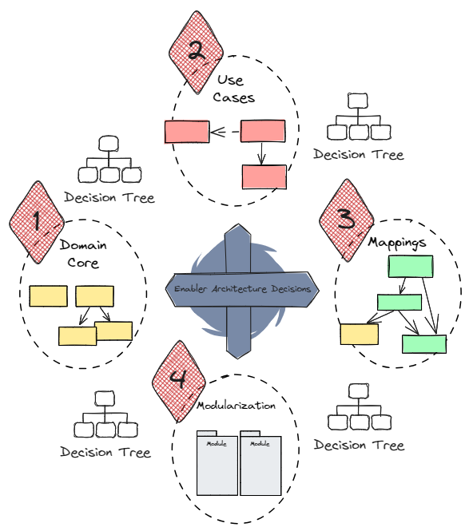

# Das Tactical Architecture Game - Starting Architecture Decisions

## Kartendeck

## Ziel des Spiels

Das Tactical Architecture Game - Starting Architecture Decisions hat das Ziel, 
grundlegende Architekturentscheidungen zu diskutieren und eine Teamentscheidung im Konsent für jede 
relevante Fragestellung zu finden. Hierfür stellt das Spiel ein Set an Entscheidungen, die Starting Architecture Decisions, eingeteilt in 
Entscheidungskategorien, bereit.

### Die Mission

Jede Entscheidungskategorie stellt eine zu erfüllende Mission des Teams dar, die durch das Finden einer
oder mehrerer Architekturentscheidungen abgeschlossen wird. Sind alle Missionen erfüllt, ist das Spiel 
zu Ende.

## Spielvorbereitung

Zur Spielvorbereitung gehört die Vorbereitung des Spielfelds in physischer oder digitaler Form.
Weiter benötigt jede Spieler:in ein Kartendeck.

### Miro Board

Coming soon...

## Spielverlauf

Das Spiel führt die Spieler:innen entlang der Entscheidungskategorien. Für jede Entscheidung startet ein 
Entscheidungsfindungsprozess zwischen den Spieler:innen. Die Abhängigkeit einer Entscheidung zu einer anderen
sind ebenfalls durch den Spielverlauf berücksichtigt. 

Die Entscheidungskategorien werden entsprechend der beschriebenen Reihenfolge für domänenzentrierte oder
vertikal geschichtete Architekturmuster werden beschriebenen folgenden Reihenfolge durchlaufen:

Die Bestandteile des Entscheidungsfindungsprozesses einer taktischen Architekturentscheidung sind:
* Austausch über Fragestellung und Lösungsstrategie zur Förderung eines gemeinsamen Verständnisses
* Austausch über Fragestellung und Lösungsstrategie im spezifischen Projektkontext anhand bekannter 
Anwendungsfälle und Qualitätsanforderungen
* Formulierung von Entscheidungsalternativen
* Finden einer Konsententscheidung im Team

Jede Entscheidung muss innerhalb einer Timebox von 45 Minuten gefunden werden. Von dieser Timebox 
sind mindestens 15 Minuten für die Dokumentation der Architekturentscheidungen, insbesondere hinsichtlich 
verworfener Alternativen sowie Konsequenzen der Entscheidung.

> Spielfeld

