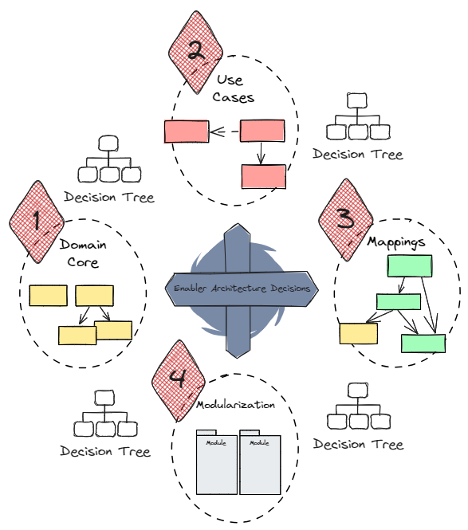

# The Tactical Architecture Game

## Objective of the Game

The Tactical Architecture Game aims to discuss fundamental architectural decisions and 
to reach a team consensus for each relevant question. For this purpose, the game provides 
a set of decisions (Enabler Architecture Decisions) divided into decision categories.

The Tactical Architecture Game can be applied to the scope of a bounded context, a development team, 
or a group of development teams aiming to achieve a consistent tactical architecture across bounded contexts
of the business domain. The game addresses tactical domain-driven design and 
domain-centric architectural patterns such as Clean Architecture, Hexagonal Architecture, 
or Onion Architecture.

### The Mission

Each decision category represents a mission to be accomplished by the team, which is completed by 
finding at least one or more architectural decisions. The game ends when all missions are accomplished.

## Game Preparation

Game preparation includes setting up the playground in physical or digital form. The scope must be 
clarified and documented on the playground beforehand.

The playing field contains decision categories and questions for the decisions to be made. 
The game cards describe both - suitable patterns and solution strategies.

## Game Progress

The game guides the players through the decision categories, from the inner 
_Ring / Hexagon / Onion_ to the outer one. A decision-making process starts between the players 
for each decision. Interactions between decisions are indicated on the playground and must also 
be considered during the decision-making process.

The decision categories are processed in the following order:

1. **Domain Core**
2. **Use Cases**
3. **Mappings**
4. **Modularization**

The components of the decision-making process for a tactical architecture decision include:

* Discussing the question and solution strategy for common understanding
* Discussing the question and solution strategy in the specific project context based on known 
use cases and quality requirements
* Formulating decision alternatives
* Reaching a team consensus

Each decision must be made within a timebox of 30 minutes. At least 10 minutes of this timebox must be used for 
formulating decision alternatives and making the decision. For large teams, the timebox can be 
extended but should not exceed 45 minutes as a guideline.

> Playground

